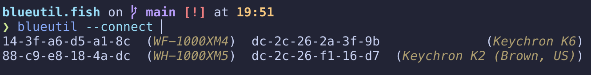

# ᛒ blueutil.fish 🐟

A [Fish] plugin that provides completion support for [Blueutil].

The killer feature of these completions is that they intelligently suggest
relevant device IDs with descriptions:



## 📦 Installation

Install this plugin with [Fisher][fisher]:

```fish
fisher install gregorias/blueutil.fish
```

[Blueutil]: https://github.com/toy/blueutil
[Fish]: https://fishshell.com/
[fisher]: https://github.com/jorgebucaran/fisher
